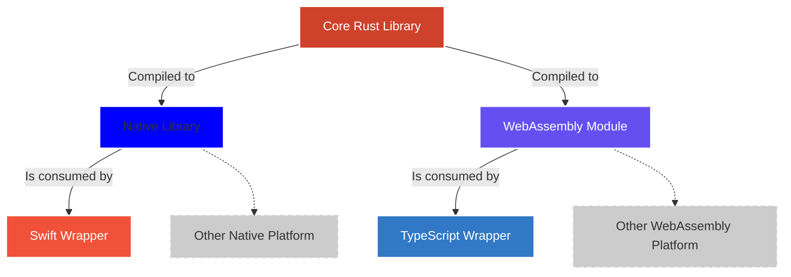
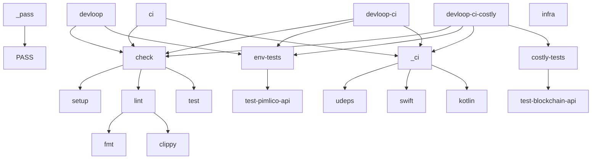

# Yttrium

Yttrium is a cross-platform library designed for working with smart accounts, currently focused on the Ethereum ecosystem.

> [!CAUTION]
> This project is under heavy development and is currently in a pre-alpha state.

## Overview

Yttrium simplifies the process of building applications that utilize account abstraction. It provides essential abstractions and primitives for Wallets and DApps to interact with and implement smart account functionality.

A primary goal of this project is to enable externally owned account (EOA) wallets to offer advanced features such as batch transactions and transaction sponsorship to their users.

While initially focused on Ethereum, Yttrium aims to be a cross-chain account abstraction library.

## Architecture

The following diagram provides an overview of the Yttrium architecture:



## Standards

In the near future, Yttrium will implement the following standards:
* ERC-4337 (in development)
* ERC-7702 (in development)

Additional standards and features will be added as the project evolves.

## Available APIs

Yttrium currently provides APIs for:
* Swift
* Rust

Planned future APIs include:
* JavaScript/TypeScript (via WebAssembly)
* Kotlin
* Flutter
* C#/Unity

## Target Platforms

Currently supported platforms:
* Apple platforms (iOS, macOS)
* Linux

Planned future support includes:
* WebAssembly
* Android
* Web
* Windows

## Installation and Setup

### Development Dependencies

To contribute to this project, ensure you have the following dependencies installed:

- `just` - `cargo install just`
- `rustup`
- Rust latest stable installed
- `swiftc` and Xcode
- `make`

```bash
rustup toolchain install nightly -t armv7-linux-androideabi,aarch64-linux-android -c rust-src
```

### Setup

After installing the above dependencies, you can run `just ci` to run the checks that CI does and initialize your repo.

You must run `just infra` to run a local anvil and a mock alto bundler which is required by some of these tests.

### Devloop

During normal development you can use the `just devloop` command to test your code both during development and before comitting/pushing. This is handy as it runs as many checks as possible and fixes any issues (such as formatting) automatically.

This command does not require any configuration.

```bash
just devloop
```

TODO: make this setup anvil automatically

### Specific tests

Some tests require some configuration (such as funds on Sepolia). For these, supply `FAUCET_MNEMONIC` and add some funds on the account.

#### Pimlico/Sepolia

```bash
just test-pimlico-api
```

Required environment variables:

```text
FAUCET_MNEMONIC
PIMLICO_API_KEY
PIMLICO_BUNDLER_URL
PIMLICO_RPC_URL
```

## Justfile targets

There are various `just` targets to use depending on your scenario. This shows approximately what happens for each target, as this diagram may be out-of-date. Take a look at the comments inside `justfile` for more information.


