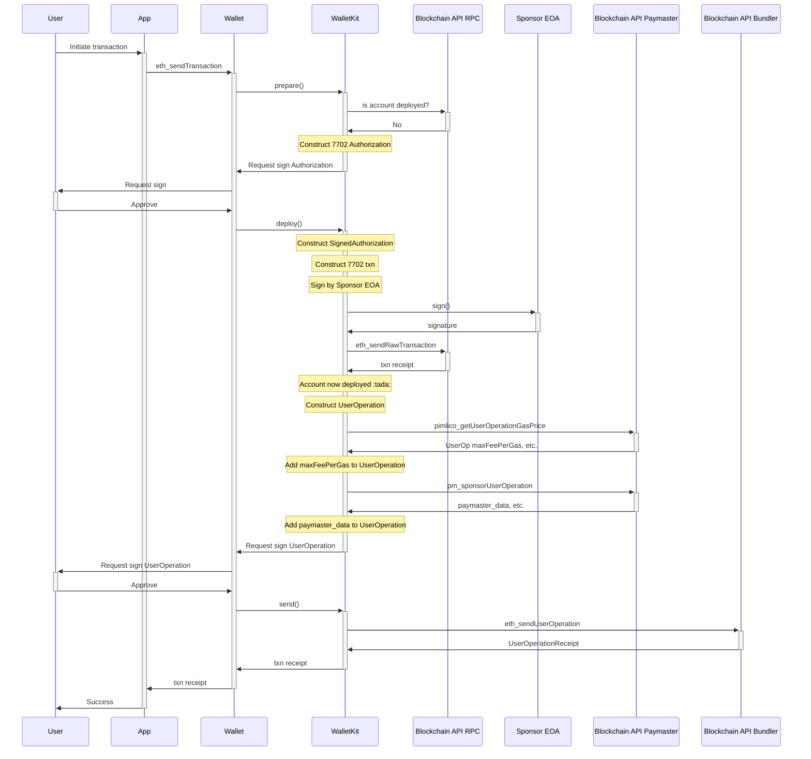

## Current design

Sponsor EOA is an EOA that has enough funds to pay for and execute the 7702 txn on the chain.

This diagram assumes current 4337 and paymasters stay the same.

## Ideal

Ideally 4337 and paymasters support 7702 natively and then it would look like:

- TODO: only 2 methods, not 3
- TODO: paymaster pays for 7702 txn
- FIXME: bundlers can't execute `AddSafe7579Contract::addSafe7579Call` because it's not a UserOp?
  - Or maybe this is the factory? :thinking:

Update pain points doc with the above
