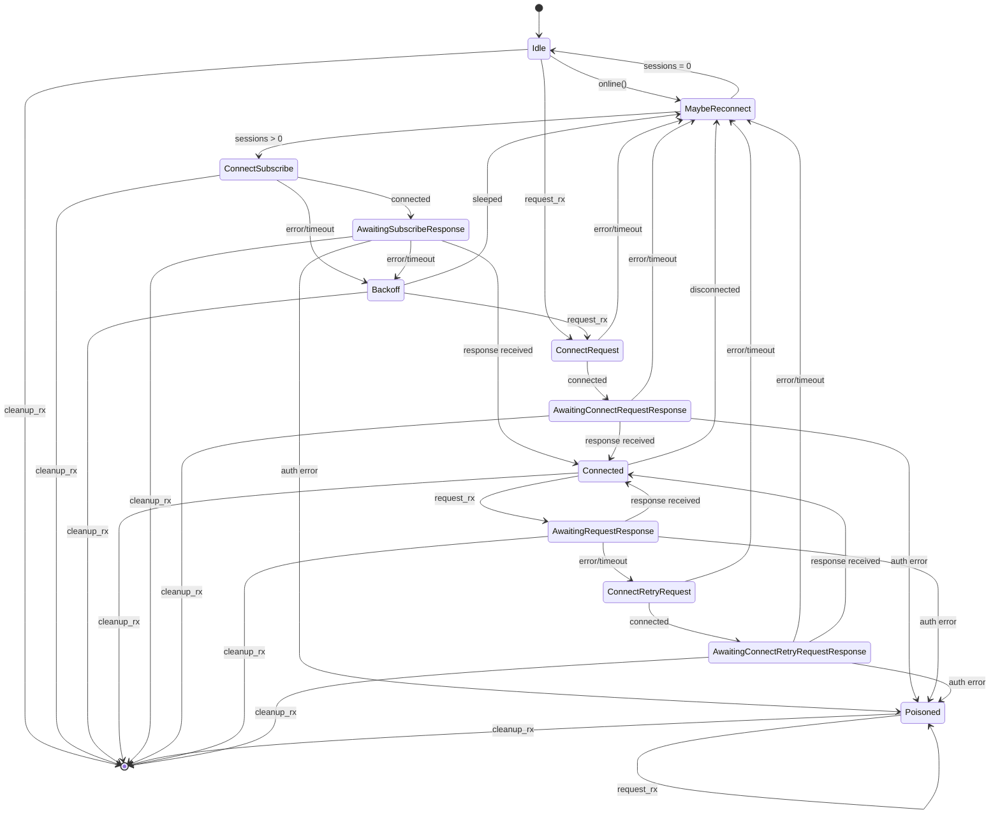

```mermaid
stateDiagram-v2
    [*] --> Idle
    Idle --> MaybeReconnect: online()
    Idle --> ConnectRequest: request_rx
    Idle --> [*]: cleanup_rx
    MaybeReconnect --> ConnectSubscribe: sessions > 0
    MaybeReconnect --> Idle: sessions = 0
    ConnectSubscribe --> AwaitingSubscribeResponse: connected
    ConnectSubscribe --> Backoff: error/timeout
    ConnectSubscribe --> [*]: cleanup_rx
    Backoff --> MaybeReconnect: sleeped
    Backoff --> ConnectRequest: request_rx
    Backoff --> [*]: cleanup_rx
    Connected --> MaybeReconnect: disconnected
    Connected --> AwaitingRequestResponse: request_rx
    Connected --> [*]: cleanup_rx
    AwaitingSubscribeResponse --> Connected: response received
    AwaitingSubscribeResponse --> Poisoned: auth error
    AwaitingSubscribeResponse --> [*]: cleanup_rx
    AwaitingConnectRequestResponse --> Poisoned: auth error
    ConnectRequest --> AwaitingConnectRequestResponse: connected
    AwaitingConnectRequestResponse --> Connected: response received
    AwaitingConnectRequestResponse --> MaybeReconnect: error/timeout
    Poisoned --> Poisoned: request_rx
    AwaitingSubscribeResponse --> Backoff: error/timeout
    AwaitingConnectRequestResponse --> [*]: cleanup_rx
    ConnectRequest --> MaybeReconnect: error/timeout
    Poisoned --> [*]: cleanup_rx
    AwaitingRequestResponse --> ConnectRetryRequest: error/timeout
    AwaitingRequestResponse --> Poisoned: auth error
    AwaitingRequestResponse --> Connected: response received
    AwaitingRequestResponse --> [*]: cleanup_rx
    ConnectRetryRequest --> MaybeReconnect: error/timeout
    AwaitingConnectRetryRequestResponse --> MaybeReconnect: error/timeout
    AwaitingConnectRetryRequestResponse --> Poisoned: auth error
    AwaitingConnectRetryRequestResponse --> Connected: response received
    ConnectRetryRequest --> AwaitingConnectRetryRequestResponse: connected
    AwaitingConnectRetryRequestResponse --> [*]: cleanup_rx
```
