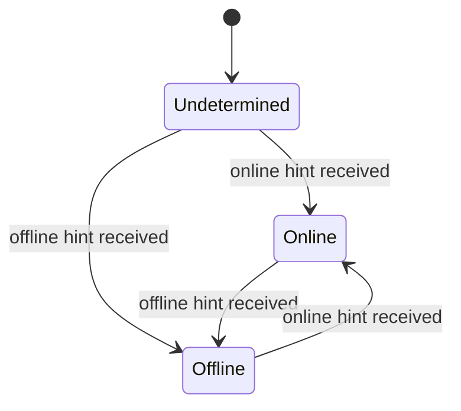
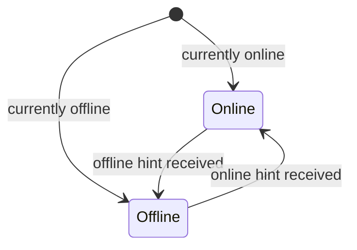
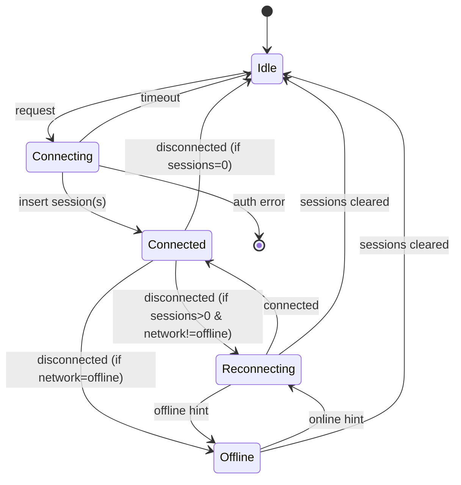

Network state. On startup status is undetermined. But when receiving an online or offline event this state machine will transition.

```mermaid
stateDiagram-v2
    [*] --> Undetermined
    Undetermined --> Online: online hint received
    Undetermined --> Offline: offline hint received
    Online --> Offline: offline hint received
    Offline --> Online: online hint received
```

```mermaid
stateDiagram-v2
    [*] --> Online: currently online
    [*] --> Offline: currently offline
    Online --> Offline: offline hint received
    Offline --> Online: online hint received
```

```mermaid
stateDiagram-v2
    [*] --> Idle
    Connected --> Reconnecting: disconnected (if sessions>0 & network!=offline)
    Connected --> Offline: disconnected (if network=offline)
    Connected --> Idle: disconnected (if sessions=0)
    Reconnecting --> Connected: connected
    Reconnecting --> Idle: sessions cleared
    Reconnecting --> Offline: offline hint
    Offline --> Reconnecting: online hint
    Offline --> Idle: sessions cleared
    Idle --> Connecting: request
    Connecting --> Connected: insert session(s)
    Connecting --> Idle: timeout
    Connecting --> [*]: auth error
```

Requirements:

- 
