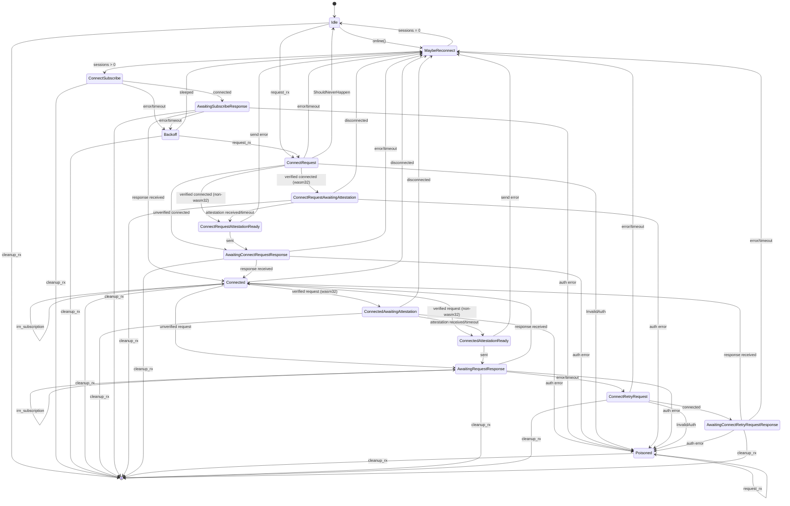

```mermaid
stateDiagram-v2
    [*] --> Idle
    Idle --> MaybeReconnect: online()
    Idle --> ConnectRequest: request_rx
    Idle --> [*]: cleanup_rx
    MaybeReconnect --> ConnectSubscribe: sessions > 0
    MaybeReconnect --> Idle: sessions = 0
    ConnectSubscribe --> AwaitingSubscribeResponse: connected
    ConnectSubscribe --> Backoff: error/timeout
    ConnectSubscribe --> [*]: cleanup_rx
    Backoff --> MaybeReconnect: sleeped
    Backoff --> ConnectRequest: request_rx
    Backoff --> [*]: cleanup_rx
    Connected --> MaybeReconnect: disconnected
    Connected --> AwaitingRequestResponse: unverified request
    Connected --> ConnectedAwaitingAttestation: verified request (wasm32)
    Connected --> ConnectedAttestationReady: verified request (non-wasm32)
    Connected --> Connected: irn_subscription
    Connected --> [*]: cleanup_rx
    ConnectedAwaitingAttestation --> ConnectedAttestationReady: attestation received/timeout
    ConnectedAwaitingAttestation --> MaybeReconnect: disconnected
    ConnectedAwaitingAttestation --> Poisoned: auth error
    ConnectedAwaitingAttestation --> [*]: cleanup_rx
    ConnectedAttestationReady --> AwaitingRequestResponse: sent
    ConnectedAttestationReady --> MaybeReconnect: send error
    AwaitingSubscribeResponse --> Connected: response received
    AwaitingSubscribeResponse --> Poisoned: auth error
    AwaitingSubscribeResponse --> [*]: cleanup_rx
    AwaitingConnectRequestResponse --> Poisoned: auth error
    ConnectRequest --> AwaitingConnectRequestResponse: unverified connected
    ConnectRequest --> ConnectRequestAwaitingAttestation: verified connected (wasm32)
    ConnectRequest --> ConnectRequestAttestationReady: verified connected (non-wasm32)
    ConnectRequest --> MaybeReconnect: error/timeout
    ConnectRequest --> Poisoned: InvalidAuth
    ConnectRequest --> Idle: ShouldNeverHappen
    ConnectRequestAwaitingAttestation --> ConnectRequestAttestationReady: attestation received/timeout
    ConnectRequestAwaitingAttestation --> MaybeReconnect: disconnected
    ConnectRequestAwaitingAttestation --> Poisoned: auth error
    ConnectRequestAwaitingAttestation --> [*]: cleanup_rx
    ConnectRequestAttestationReady --> AwaitingConnectRequestResponse: sent
    ConnectRequestAttestationReady --> MaybeReconnect: send error
    AwaitingConnectRequestResponse --> Connected: response received
    AwaitingConnectRequestResponse --> MaybeReconnect: error/timeout
    Poisoned --> Poisoned: request_rx
    AwaitingSubscribeResponse --> Backoff: error/timeout
    AwaitingConnectRequestResponse --> [*]: cleanup_rx
    Poisoned --> [*]: cleanup_rx
    AwaitingRequestResponse --> ConnectRetryRequest: error/timeout
    AwaitingRequestResponse --> Poisoned: auth error
    AwaitingRequestResponse --> Connected: response received
    AwaitingRequestResponse --> AwaitingRequestResponse: irn_subscription
    AwaitingRequestResponse --> [*]: cleanup_rx
    ConnectRetryRequest --> AwaitingConnectRetryRequestResponse: connected
    ConnectRetryRequest --> MaybeReconnect: error/timeout
    ConnectRetryRequest --> Poisoned: InvalidAuth
    ConnectRetryRequest --> [*]: cleanup_rx
    AwaitingConnectRetryRequestResponse --> Connected: response received
    AwaitingConnectRetryRequestResponse --> Poisoned: auth error
    AwaitingConnectRetryRequestResponse --> MaybeReconnect: error/timeout
    AwaitingConnectRetryRequestResponse --> [*]: cleanup_rx
```
